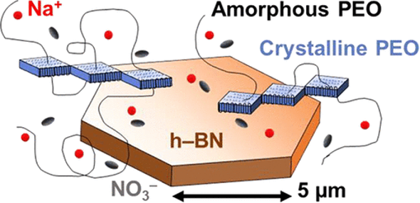
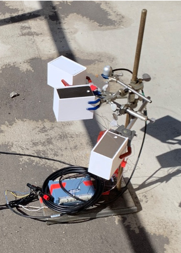
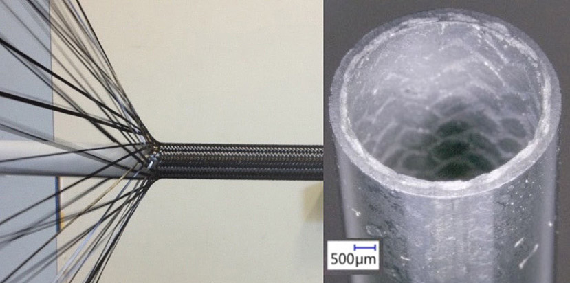
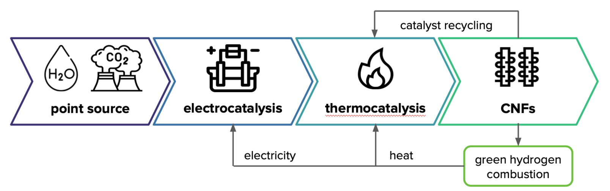

# Projects
- [Sodium Battery Electrolytes](#sodium-battery-electrolytes)
- [Thermal Test Stand](#thermal-coating-test-stand)
- [Ceramic Composites](#ceramic-composite-process-development)
- [Fusion Energy Modeling](#fusion-energy-modeling-with-ansys)
- [Carbon Upcycled](#carbon-upcycled-co2-capture-reactor-design)

 

## Sodium Battery Electrolytes
### _peer-reviewed materials engineering research_ 

I led the development of novel composite polymer electrolytes to improve the energy density and safety of sodium-ion batteries. After a thorough literature review, I introduced boron nitride (BN) filler to a poly(ethylene oxide)–sodium electrolyte. My goal was to optimize ionic conductivity by reducing crystallinity and increasing dissociated ion content. I managed the experimental workflow, supporting and collaborating with two theorists. I also analyzed and plotted the data in Python (scipy, pandas, and seaborn), including deconvoluting overlapping FTIR peaks and automating full width at half maximum measurements. 

My research established a non-monotonic relationship between BN, polymer crystallinity, and ionic conductivity. This finding was published in the [first of two peer-reviewed papers](https://pubs.acs.org/doi/10.1021/acs.jpcc.3c06455){:target="_blank"}. The [second paper](https://pubs.acs.org/doi/full/10.1021/acs.chemmater.4c01192){:target="_blank"} built on this knowledge, using a new salt, NaFSI, to increase conductivity (via increased dissociation). These results contribute to safer, more efficient solid polymer electrolytes and provide key insights into how fillers affect ion transport in solid-state batteries.

For more details, check out these **[slides](./assets/documents/VIPR 121 Final Presentation.pdf){:target="_blank"}** or the **[poster](./assets/documents/APS Electrolyte Poster Final.pdf){:target="_blank"}** I presented at the national [APS conference](https://march.aps.org){:target="_blank"}!

To complete this research project, I learned a wide variety of materials processing and characterization techniques:
- Glove box operation and air-free chemistry
- X-ray diffraction
- Scanning electron microscopy
- Mechanical testing
- Differential scanning calorimetry and thermogravimetric analysis
- FTIR and Raman spectroscopy
- Electrochemical impedance (dielectric) spectroscopy

  
## Thermal Coating Test Stand
### _enabling materials discovery for urban heat_

I developed a thermal test stand to evaluate the cooling performance of composite roof coatings, which are intended to improve building energy efficiency and combat urban heat. Using Fusion 360, I designed a "model house" that could accommodate type T thermocouples (selected for their accuracy in the 50–100°C range), humidity sensors, and aluminum test substrates. I then 3D-printed the models with white ASA material, which minimized unwanted solar absorbance and prevented deformation (due to the high glass transition temperature of ASA). Finally, I integrated a pyranometer to measure solar flux, enabling representative outdoor testing under uncontrolled radiation conditions. 

After executing three control studies to confirm the system’s accuracy, I programmed an Omega data acquisition system to automate irradiation tests. This increased throughput 6x (previously 3 hours per sample) through parallel testing and automatic data logging. Finally, I analyzed and visualized my results in Python. The project successfully demonstrated the effectiveness of the coatings in reducing thermal loads, contributing to the development of more energy-efficient roofing materials.

Check out an earlier Arduino-based iteration of this project **[here](./assets/documents/Cool Roofs Design V1.pdf){:target="_blank"}**!

  

## Ceramic Composite Process Development
### _nuclear materials engineering internship_ 

I had the opportunity to intern at General Atomics during the summer of 2024. Due to the confidential nature of this work, I'm limited in what I can disclose, but my project focused on improving the performance and manufacturing efficiency of silicon carbide composites for harsh environments (fusion, fission, hydrogen turbines). My work resulted in an 80% reduction in process energy intensity, slashing costs and emissions. Skills I used included: 

- Fiber winding and layup
- Furnace operation for chemical vapor infiltration and deposition (CVI/CVD)
- MATLAB and Excel programming
- SolidWorks CAD design
- Electrical power metering
- Process modeling (duration, energy intensity, carbon emissions, cost)
- Polymer synthesis and characterization

  

## Fusion Energy Modeling with ANSYS
### _computational physics for the future of energy_
During an (ongoing) internship at Princeton Plasma Physics Laboratory, I modeled energy extraction from fusion plasmas by simulating a fluidized bed heat exchanger using Ansys Fluent CFD. The project aims to optimize the heat transfer processes within this system to improve the efficiency of future fusion power plant designs. I'm using the simulations to compare the performance of various thermodynamic cycles, assessing their effectiveness in converting the extracted thermal energy into usable fusion power. The simulations will provide insights into which cycles offer the highest efficiencies, informing the design of more effective heat exchangers for fusion.
  

## Carbon Upcycled: CO2 Capture Reactor Design
### _startup concept to make carbon capture profitable_

I designed a self-sustaining reactor to commercialize innovative chemistry from Brookhaven National Lab (Nature Catalysis 7, 98–109, 2024). The reactor converts CO2 and water into valuable carbon nanofibers, with oxygen and hydrogen as byproducts. The hydrogen and oxygen are then combusted to power a thermocatalytic reactor, making the system truly carbon-negative. This concept could potentially become the first profitable carbon capture reactor in history.
I conducted a technoeconomic analysis of each process step, complementing my two teammates' research on the CO2 capture and carbon nanofiber markets. The concept was pitched in the Department of Energy’s Energy Tech University Prize competition, where it was selected as a national semifinalist.

**[View our pitch deck here!](./assets/documents/Carbon Upcycled Pitch.pdf){:target="_blank"}**
